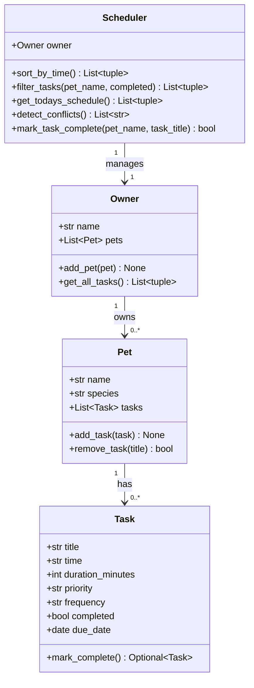
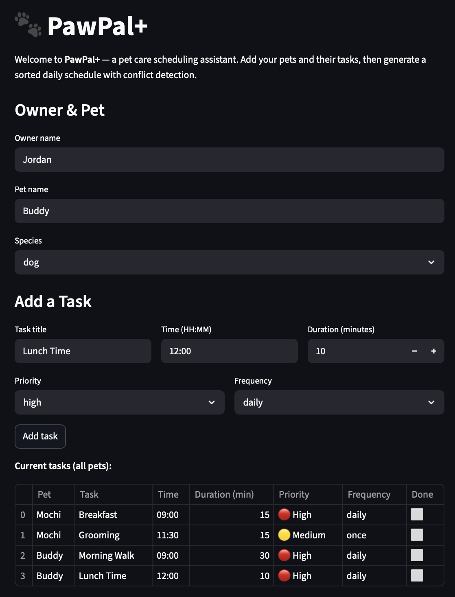
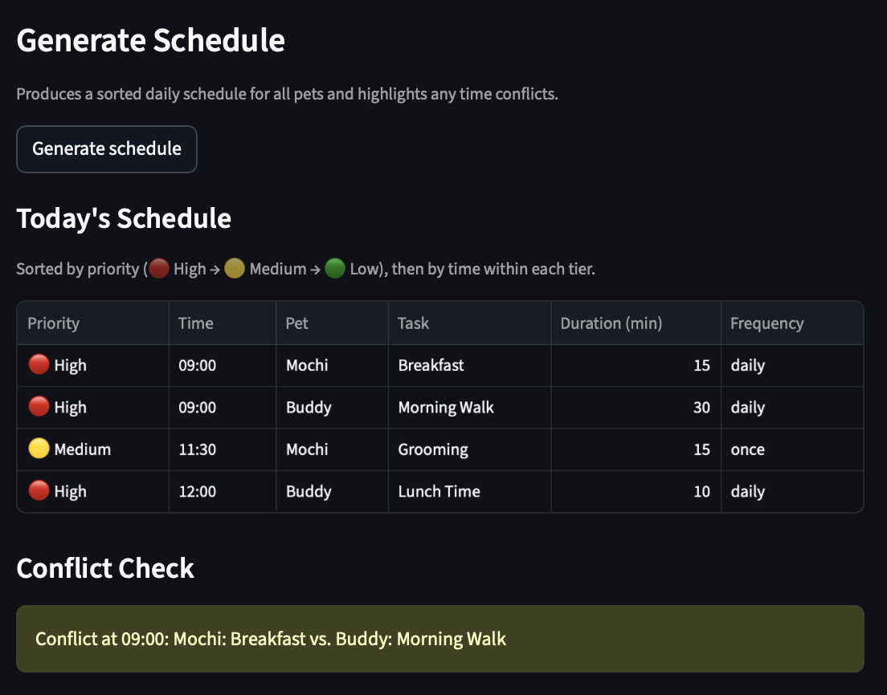

# PawPal+ (Module 2 Project)

You are building **PawPal+**, a Streamlit app that helps a pet owner plan care tasks for their pet.

## Scenario

A busy pet owner needs help staying consistent with pet care. They want an assistant that can:

- Track pet care tasks (walks, feeding, meds, enrichment, grooming, etc.)
- Consider constraints (time available, priority, owner preferences)
- Produce a daily plan and explain why it chose that plan

Your job is to design the system first (UML), then implement the logic in Python, then connect it to the Streamlit UI.

## What you will build

Your final app should:

- Let a user enter basic owner + pet info
- Let a user add/edit tasks (duration + priority at minimum)
- Generate a daily schedule/plan based on constraints and priorities
- Display the plan clearly (and ideally explain the reasoning)
- Include tests for the most important scheduling behaviors

## Getting started

### Setup

```bash
python -m venv .venv
source .venv/bin/activate  # Windows: .venv\Scripts\activate
pip install -r requirements.txt
```

### Suggested workflow

1. Read the scenario carefully and identify requirements and edge cases.
2. Draft a UML diagram (classes, attributes, methods, relationships).
3. Convert UML into Python class stubs (no logic yet).
4. Implement scheduling logic in small increments.
5. Add tests to verify key behaviors.
6. Connect your logic to the Streamlit UI in `app.py`.
7. Refine UML so it matches what you actually built.

### Run the app

```bash
streamlit run app.py
```

### Run the CLI demo

```bash
python main.py
```

---

## System Design



---

## Features

- **Task management** — add tasks with title, time (HH:MM), duration, priority (low/medium/high), and frequency (once/daily/weekly)
- **Multi-pet support** — manage tasks across multiple pets under one owner
- **Priority-first scheduling** — daily schedule sorts by priority tier (High → Medium → Low) then by time within each tier, with 🔴🟡🟢 color coding in the UI
- **Sorting by time** — `sort_by_time()` available for pure chronological ordering using HH:MM lexicographic sort
- **Conflict detection** — flags any two incomplete tasks scheduled at the exact same time with a warning message
- **Recurring tasks** — marking a daily or weekly task complete automatically creates the next occurrence with an updated due date
- **Filtering** — filter tasks by pet name or completion status

## Smarter Scheduling

PawPal+ goes beyond a basic task list with four algorithmic features:

- **Priority-first scheduling**: `get_todays_schedule()` sorts by priority tier (🔴 High → 🟡 Medium → 🟢 Low) and then by time within each tier. This ensures the most critical tasks are always at the top of the plan, not buried by early-but-low-priority items.
- **Chronological sorting**: `sort_by_time()` sorts tasks by their "HH:MM" time string. Because this format sorts lexicographically the same way it sorts chronologically, no datetime parsing is needed — just a simple `sorted()` with a lambda key.
- **Conflict detection**: The scheduler groups all incomplete tasks by their scheduled time using a dictionary. Any time slot with more than one task triggers a warning, giving the owner an immediate heads-up without crashing the app.
- **Automatic recurrence**: When a `daily` or `weekly` task is marked complete, `mark_complete()` returns a copy of the task with a new `due_date` (today + 1 or 7 days). The scheduler adds this copy back to the pet's task list automatically.

---

## Testing PawPal+

Run the full test suite with:

```bash
python -m pytest tests/ -v
```

The suite covers five key behaviors:

| Test | What it verifies |
|------|-----------------|
| `test_mark_complete_changes_status` | `completed` flips to `True`; "once" tasks return no next occurrence |
| `test_add_task_increases_count` | `pet.tasks` grows correctly after each `add_task()` call |
| `test_sort_by_time_chronological` | Out-of-order tasks come back sorted "08:00" → "11:30" → "14:00" |
| `test_recurrence_creates_next_task` | A "daily" task's next occurrence has `due_date = today + 1 day` |
| `test_conflict_detection` | Two tasks at "09:00" produces exactly one conflict warning |

## Results


